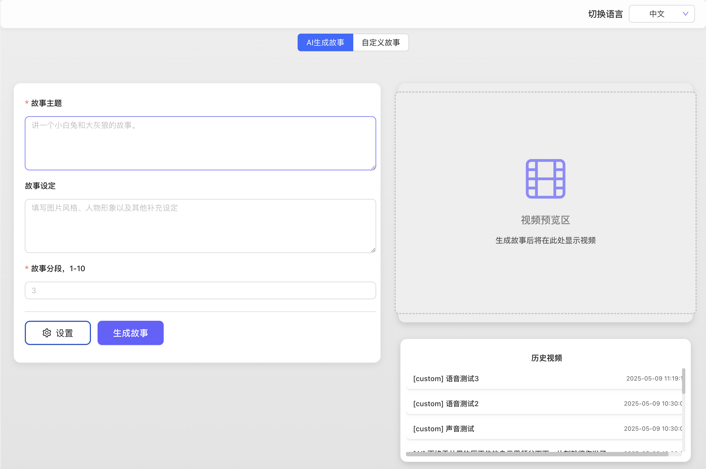
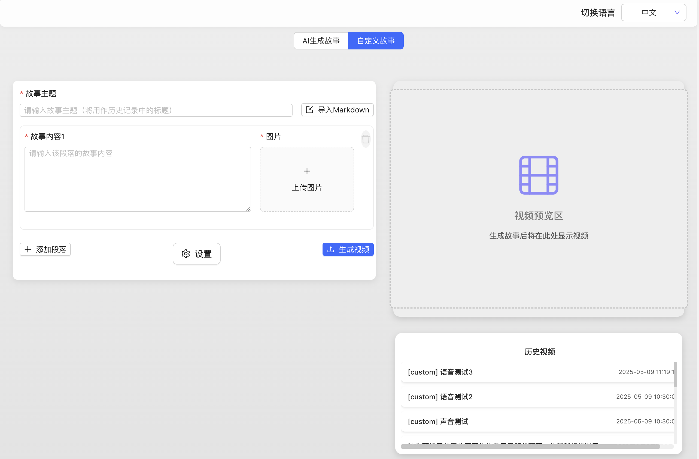
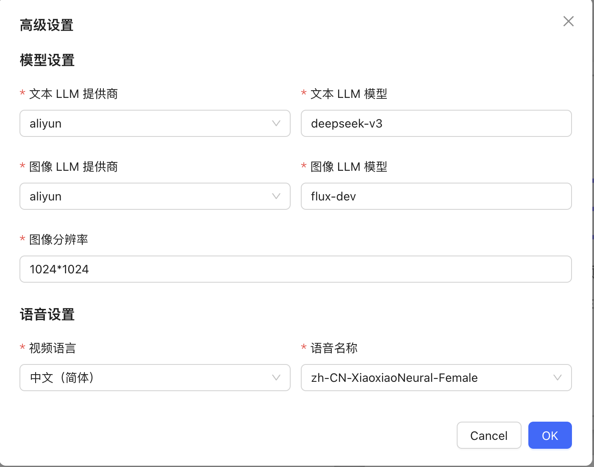

[English](./README.md) | 简体中文


## 项目说明

本项目是基于alecm20/story-flicks项目开发而来，因为本人代码能力有限，主要依靠AI编程Trae进行开发，所以单独开了本项目。
可以支持用户用一句生成视频，或者基于已有的故事和图片合成视频
视频中包含图片、故事讲解，以及音频和字幕信息。
目前主要有两个模块
- 1.AI故事生成，支持用户输入故事主题和图片设定后自动调用后台服务生成视频，在视频正式生成之前可以手动调整大模型生成好的故事文本和图片提示词
- 2.自定义故事，支持用户自己输入故事文本和上传图片，并且支持一键导入markdown格式的故事，自动拆分成故事，而后自动合成后续的视频
项目后端技术栈为 python + fastapi 框架，前端为 react + antd + vite。


## 界面截图






## 使用说明

### 1. 下载本项目
原始项目：
```
git clone https://github.com/bebetterst/story-maker.git
```

### 2. 设置模型信息

```
# 先切换到项目的 backend 目录下
cd backend

cp .env.example .env


text_provider="openai"    # 文本生成模型的提供商，目前支持 openai和 aliyun、deepseek、ollama、siliconflow，阿里云文档：https://www.aliyun.com/product/bailian

image_provider="aliyun"   # 图片生成模型的提供商，目前支持 openai和 aliyun、siliconflow

openai_base_url="https://api.openai.com/v1" # openai 的 baseUrl

aliyun_base_url="https://dashscope.aliyuncs.com/compatible-mode/v1" # 阿里云的 baseUrl

deepseek_base_url="https://api.deepseek.com/v1" # deepseek 的 baseUrl

ollama_base_url="http://localhost:11434/v1" # ollama 的 baseUrl

siliconflow_base_url="https://api.siliconflow.cn/v1" # siliconflow 的 baseUrl


openai_api_key= # openai 的 api key，可以只填一个

aliyun_api_key= # 阿里云百炼的 api key，可以只填一个

deepseek_api_key= # deepseek 的 api key，目前该 api_key 只支持文本生成,deepseek的推理模式不支持json输出，所以用不了

ollama_api_key= # 如果需要使用的话，请填写ollama，目前该 api_key 只支持文本生成，并且不能用参数量太小的模型，推荐qwen2.5:14b 或者更大的模型。

siliconflow_api_key= # siliconflow 的文本模型目前只支持兼容 OpenAI 格式的大模型，如：Qwen/Qwen2.5-7B-Instruct。图像模型只测试了：black-forest-labs/FLUX.1-dev

text_llm_model=gpt-4o # 如果 text_provider 设置为 openai，这里只能填 OpenAI 的模型，如：gpt-4o。如果设置了 aliyun，可以填阿里云的大模型，如：qwen-plus 或者 qwen-max。ollama 的模型不能使用体积太小的模型，否则无法输出正确的 json，可以使用如：qwen2.5:14b 或更大的模型。

image_llm_model=flux-dev # 如果 image_provider 设置为 openai，这里只能填 OpenAI 的模型，如：dall-e-3。如果设置了 aliyun，可以填阿里云的大模型，阿里云推荐使用：flux-dev，目前可以免费试用，具体参考：https://help.aliyun.com/zh/model-studio/getting-started/models#a1a9f05a675m4。

```

### 3. 启动项目

#### 3.1 手动启动

在安装完所有的依赖以后，可以直接使用脚本start_dev.sh启动项目。
命令：./start_dev.sh
**启动后端项目**

```
# 先切换到项目根目录
cd backend
conda create -n story-flicks python=3.10 # 这里使用 conda，其他的虚拟环境创建方式也可以,例如：python3.10 -m venv story-flicks

conda activate story-flicks # 激活虚拟环境，如果是用的python自带的，则使用source story-flicks/bin/activate
pip install -r requirements.txt
uvicorn main:app --reload

```
如果项目成功，会有如下信息输出：

```
INFO:     Uvicorn running on http://127.0.0.1:8000 (Press CTRL+C to quit)
INFO:     Started reloader process [78259] using StatReload
INFO:     Started server process [78261]
INFO:     Waiting for application startup.
INFO:     Application startup complete.
```

**启动前端项目**

```
# 先切换到项目根目录
cd frontend
npm install
npm run dev

#启动成功之后打开：http://localhost:5173/
```
启动成功会输出如下信息:

```
  VITE v6.0.7  ready in 199 ms

  ➜  Local:   http://localhost:5173/
  ➜  Network: use --host to expose
  ➜  press h + enter to show help
```

#### 3.2 通过docker启动

在项目根目录下，执行：
```
docker-compose up --build
```
成功之后打开前端项目：http://localhost:5173/

### 4. 开始使用

根据界面中的字段，选择文本生成模型提供商、图片生成模型提供商、文本模型、图片生成模型、视频语言、声音、故事主题、故事段落，然后点击生成，即可生成视频。根据填写的段落数量，生成图片，一个段落生成一张图片，设置的段落越多，生成视频的耗时也会更久。如果成功之后，视频会展示在前端页面中。
